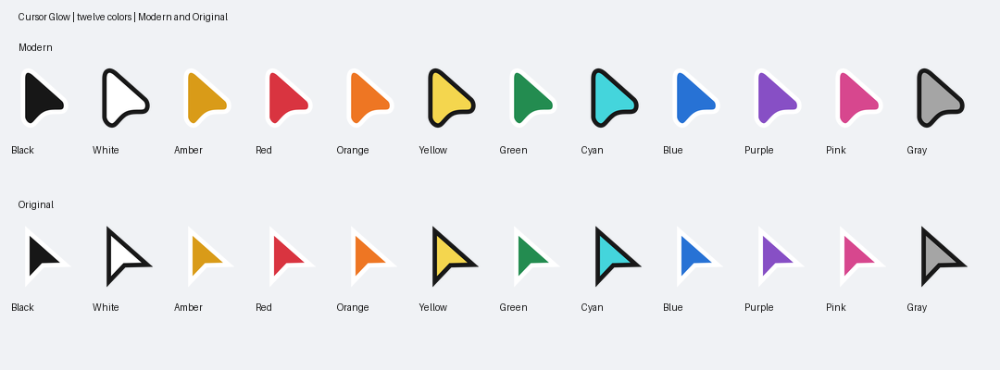

# Pointer Lumen

A local GNOME Shell extension for Ubuntu Desktop 26.04 / GNOME 50 / Wayland. Based on Hati, with twelve prebuilt Bibata color presets and a single native preferences window.

Make your pointer easy to follow during lessons, screen recordings and live demonstrations.



**Preview release:** automated build and artifact checks pass; live GNOME 50/Wayland testing remains pending. Download the Ubuntu package from [Releases](https://github.com/LincolnGothic/pointer-lumen/releases).

## What you get

- Arrow colors: Black, White, Amber, Red, Orange, Yellow, Green, Cyan, Blue, Purple, Pink and Gray.
- Rounded (Modern) or sharp (Original) pointer shapes; nominal 24, 32 or 48 pixel sizes.
- Following glow with any chosen color, adjustable diameter, radius, spread and opacity, and circle/squircle/square outline.
- Apply and Restore original cursor buttons. Your original theme and size are saved before the first Apply and retained across logins. Restore also switches off the glow.

Opening preferences does not change your arrow. Choose a color, shape and size, then press Apply cursor. Glow controls apply immediately. The ring around the cursor and the arrow itself have separate sizes and colors.

Inertia, magnifier, spotlight, click animations, rainbow mode and stationary auto-hide are off by default. Prebuilt themes include 48, 64 and 96 pixel raster images for 2x scaling. Themes include text, hand, resize, drag-and-drop and animated busy pointer states.

The first version exposes halo/glow controls. Spotlight (screen dimming) and click ripples are retained from Hati internally but are not available in the preferences interface.

## Install on Ubuntu

### Debian package

Download `pointer-lumen_0.1.0-1_all.deb` from Releases. In the download folder, run:

```bash
sudo apt install ./pointer-lumen_0.1.0-1_all.deb
```

The package installs system-wide in `/usr/share/gnome-shell/extensions/` and `/usr/share/icons/`; APT manages dependencies. It requires GNOME Shell 50 and is intended for Wayland. Log out and back in, then enable the extension and open settings with the commands below. Installation does not enable the extension or apply a cursor automatically.

Use one installation format. Existing user-local ZIP installations take precedence over the system-wide extension; the Debian package does not modify them. Restore your original cursor before removing the package through your package manager.

### User-local ZIP

Extract the release ZIP into a folder. Open a terminal inside that folder, in your normal GNOME Wayland desktop session, and run:

```bash
bash install.sh
```

The installer requires the GNOME-provided `gnome-shell`, `gnome-extensions`, `glib-compile-schemas`, and `unzip`. If a command is missing, install its Ubuntu package first. No Python, Node, network download or sudo is used by the installer.

Log out and back in after installation. Enable the extension and open its settings:

```bash
gnome-extensions enable cursor-glow@local
gnome-extensions prefs cursor-glow@local
```

The installer respects `XDG_DATA_HOME`, normally `~/.local/share`. It installs the extension in `gnome-shell/extensions/cursor-glow@local/` and 24 `CursorGlow-*` themes in `icons/`. It refuses an existing target before writing any files. It never deletes files. Keep the extracted release folder for its source and licenses.

Pointer Lumen keeps the original `cursor-glow@local` installation identity and `CursorGlow-*` theme names to preserve existing settings. The ZIP contains everything needed for installation; a Git checkout requires building the themes first.

To stop the glow, switch it off in preferences or disable the extension:

```bash
gnome-extensions disable cursor-glow@local
```

To restore your earlier arrow appearance, use Restore original cursor before disabling. Disabling the extension alone leaves the selected arrow theme in place.

## Ubuntu smoke test

Live GNOME execution is not verified on the Windows build host. Before treating this release as ready for daily use, check:

1. Open preferences without pressing Apply: the original arrow theme and size stay unchanged.
2. Apply several colors in both shapes and all three sizes. Check arrow, hand, text, resize and busy states in Files, Firefox and a text editor. Custom cursors drawn by applications may ignore the system theme.
3. Move and click across application windows, the top bar and both monitors if available. The glow follows the cursor and does not intercept clicks. Check mixed monitor scaling if applicable.
4. Change glow color, opacity, diameter and radius; switch it off and on.
5. Log out/in: the selected theme, size and glow settings persist.
6. Restore original cursor: the original theme and size return and glow turns off. Apply another preset and restore again.
7. Disable and re-enable the extension, including a quick toggle; there should be no leftover ring or GNOME Shell errors.

GNOME 51 and other desktop environments are outside v1's supported scope. GTK/Qt applications can cache cursor themes; reopening an affected application may be needed after Apply.

## Source and licenses

The `extension/`, `build/`, `tests/` and `docs/` folders contain the derived application source. `source/bibata/` contains the original SVGs and build configuration needed to regenerate the themes. Prebuilt themes are in `themes.zip`.

- Hati: https://github.com/szymonwilczek/hati — pinned commit `59c6569138f06262b40398d627f210d7c0c0f9c2`, GPL-3.0-or-later.
- Bibata: https://github.com/ful1e5/Bibata_Cursor — v2.0.7, commit `35ccfe209a808e40d6c2ca60a46cbe4faf68b690`, GPL-3.0-or-later.
- Clickgen: https://github.com/ful1e5/clickgen — v2.2.5, build tool under MIT.
- Sharp: https://github.com/lovell/sharp — SVG rendering build tool under Apache-2.0.

Modifications in this version: independent extension identity and settings, twelve recolored themes, unified cursor/glow preferences, saved original cursor restoration, minimal defaults and user-local packaging. Original GPL notices are preserved; derived application and cursor assets are provided under GPL-3.0-or-later. Build tools are not required to use the release.

## Rebuild the themes

Build-time dependencies are Python 3.11+, Pillow, NumPy, attrs, Node and Sharp. Obtain the pinned Bibata v2.0.7 and Clickgen v2.2.5 sources. From the project folder, run:

```bash
python build/build-themes.py \
  --bibata-source /path/to/Bibata_Cursor \
  --clickgen-source /path/to/clickgen \
  --node /path/to/node \
  --sharp /path/to/node_modules/sharp
```

Use `--python-packages /path/to/packages` only when extra Python dependencies are installed outside the current interpreter. The release includes the corresponding Bibata SVG/config sources under `source/bibata/`, which may be passed as `--bibata-source`. Intermediate PNGs remain under `artifacts/build-cache/`. Verify with `python tests/test_themes.py`; set `BIBATA_SOURCE` to your source directory when building on another machine.

Run cursor settings and opacity behavior tests with `node --test --test-isolation=none tests/cursor-settings.test.mjs tests/render-highlight.test.mjs`. Package the release with `python build/package.py --bibata /path/to/Bibata_Cursor --output /path/to/pointer-lumen-v0.1.0-ubuntu.zip`. These commands are for development only.

After building the themes, create the Debian format with `python build/package-deb.py --output artifacts/pointer-lumen_0.1.0-1_all.deb` and validate it with `python tests/test_deb.py`. The builder uses Python's standard library and the Debian 2.0 archive format. Its schema is installed globally and compiled by GLib's package trigger; there are no maintainer scripts that alter user settings. Both formats share the same extension code and prebuilt themes.
